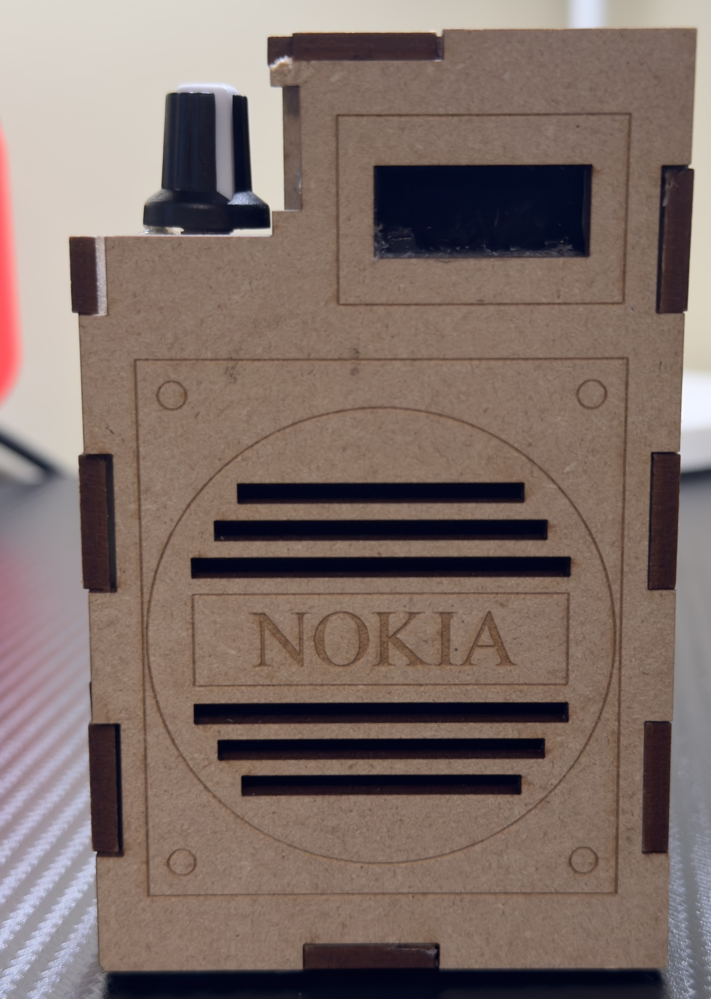

<h1>ESP32 Internet Radio</h1>

<h2>Overview</h2>

This project is an ESP32 Internet Radio inspired by the excellent work of <a href="https://educ8s.tv/esp32-internet-radio/#google_vignette">educ8s.tv.</a> Unlike traditional radios, which receive radio waves from the air, an internet radio streams radio stations via websites. It connects to the internet through a microcontroller, retrieves data from streaming websites, decodes it into audio signals using an MP3 decoder, amplifies the signals, and then plays them through a speaker.

This repository includes the code and instructions for building your own internet radio using an ESP32 microcontroller.

<h2>Why I Made This Project</h2>

I built this project to learn more about radio waves and their applications. Radio waves are an integral part of our daily lives—whether it’s Wi-Fi, Bluetooth, or cell signals. By diving into this project, I explored how radio signals work, especially in the context of streaming, decoding, and playing internet radio stations.

<h2>Components Used</h2>

Below is a list of materials I used to build the ESP32 Internet Radio, along with links to the components for your convenience:

	•	ESP32 Microcontroller: https://a.co/d/gGbqsbR 
	•	PAM8403 Amplifier: https://www.amazon.ca/dp/B0CHZ9S5QC?ref=ppx_pop_mob_ap_share 
	•	VS1053 MP3 Decoder: https://www.amazon.ca/dp/B07XCN3C7B?ref=ppx_pop_mob_ap_share
	•	2W Micro Speaker: https://www.amazon.ca/dp/B07BFTYY6L?ref=ppx_pop_mob_ap_share
	•	128x32 OLED Display: https://www.amazon.ca/dp/B07D9H83R4?ref=ppx_pop_mob_ap_share
	•	TP4056 Charging Module: https://www.amazon.ca/dp/B07XC22ZD8?ref=ppx_pop_mob_ap_share
	•	3.7V 1100mAh LiPo Battery: https://www.amazon.ca/dp/B08FD39Y5R?ref=ppx_pop_mob_ap_share
	•	Potentiometer knob, Buttons, and Switch
	•	Black Cloth (For the Speaker Grill)
	•	Prototype PCB Board
	•	Wooden Enclosure: Custom-made using a laser cutter (Sorry that I didn't make a 3D printable enclosure)

<h2>How It Works</h2>

The ESP32 microcontroller connects to the internet via Wi-Fi. It accesses the streaming websites that host radio stations, grabs the audio data, and sends it to the VS1053 MP3 decoder to decode the audio signal. The decoded signal is amplified using the PAM8403 amplifier and played through the 2W speaker. The 128x32 OLED screen is used to display the current station information and connection status.

	•	ESP32: Handles internet connection and data streaming. I chose the Esp32 because it is an affordable microcontroller that is powerful, has wifi and Bluetooth capabilities, and has a large community.
	•	VS1053: Decodes audio signals.
	•	PAM8403: Amplifies the decoded audio for the speaker.
	•	TP4056: Manages battery charging.
	•	Buttons & Switch: Used for navigating between radio stations and turning the device on/off.

<h2>Building the Project<h2><h3>*Refer to the Images folder for easier instructions*</h3>

<h3>Step 1: Breadboard Testing</h3>

Before you start soldering, it’s important to connect all the components on a breadboard and test everything. During my build, I encountered an issue where the OLED display was broken after soldering. So, always test your components first to avoid reworking the circuit later.

<h3>Step 2: Schematic</h3>

Refer to the schematic (provided in the repository) for connecting all the components. Ensure each connection is secure and correct before moving forward. Use shrink wraps so that the connections won't touch each other.

<h3>Step 3: Uploading the Code</h3>

Initially, I used the code provided by educ8s.tv, but it didn’t work as well as it should, the speaker kept on stopping and playing, making it hard to listen to. I found another improved version of the code that used an advanced library called the VS1053 stream master, but I still had issues with the libraries. So, I decided to write my own code, using simpler libraries, and that solved the problem.

You can find the working code in this repository. I hope it will help you with your project!

<h3>Step 4: Soldering</h3>

Once you’ve confirmed everything works on the breadboard, you can solder all the components together, if you are having trouble positioning the components, you can refer to the images folder in this repository to see where I positioned all the components. Be careful when soldering, as the ESP32 pins are small, and it’s easy to damage the board if you’re not precise. If you’re new to soldering, take extra care not to short any connections.

<h3>Step 5: Enclosure and Final Assembly</h3>

I used a laser cutter to create a wooden enclosure for my internet radio. If you have access to a laser cutter, you can do the same, or alternatively, I would really appreciate it if somebody could design a 3D-printed enclosure to make it more accessible to others.
	Where to put components that you can't see in the pictures:
	•	The LiPo battery is placed behind the VS1053 MP3 decoder.
	•	The TP4056 charging module and the power switch are mounted underneath the ESP32.
	•	I also designed and 3D-printed button caps to give the buttons a cleaner look.

<h3>Step 6: Final Testing</h3>

After assembly, test the device to ensure that everything functions as expected. 
	Check that:
 	•	The radio streams smoothly without interruptions.
	•	The buttons switch between radio stations properly.
	•	The battery charges and powers the device correctly.

<h2>Lessons Learned</h2>

	•	Always test components on a breadboard before soldering.
	•	Writing your own code can solve compatibility issues with libraries.
	•	Be careful when soldering small components like the ESP32 pins.
	•	It’s good to have a proper case for the device, even if it’s wooden. But a 3D-printed case would be more accessible for most people.

<h2>Future Improvements</h2>

I would love to see someone design a 3D-printed enclosure for this project. A custom, printable case would make it easier for others to replicate without the need for specialized tools like a laser cutter.

<h2>Video Demonstration</h2>

Check out the video showcasing how the ESP32 Internet Radio works: <a href="https://youtu.be/lMdWntr4xZQ?si=qNeAsw_hGhNQVQYP">Watch the video</a>

<h2>Contact</h2>

If you have any questions or need further clarification, feel free to reach out to me through my <a href="https://www.youtube.com/@ZETRO_Labs">YouTube Channel - ZETRO Labs.</a>
